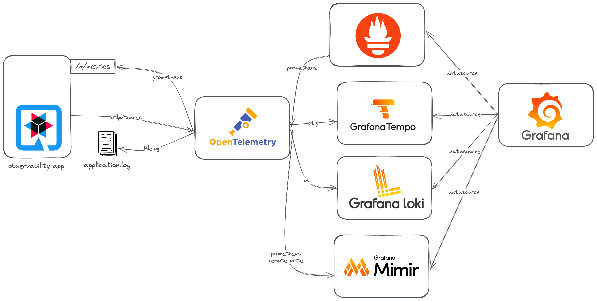
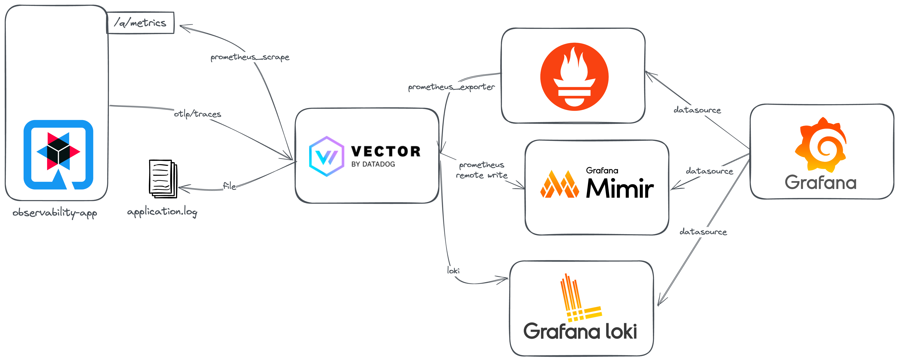

# Observability Pipeline
## OpenTelemetry


### Launch stack
#### Naïve
```bash
./mvnw clean package
docker compose -f compose.otel-collector.yml up --build
## Other Terminal
docker compose -f compose.otel-collector.yml watch
```


#### Advanced
```bash
./mvnw clean package
docker compose --env-file otel.advanced.env --profile otel -f compose.advanced.yml up --build
## Other Terminal
docker compose --env-file otel.advanced.env --profile otel -f compose.advanced.yml watch
```

## Vector By Datadog


### Launch stack
#### Naïve
```bash
./mvnw clean package
docker compose -f compose.vector.yml up --build
## Other Terminal
docker compose -f compose.vector.yml watch
```


#### Advanced
```bash
./mvnw clean package
docker compose --env-file vector.advanced.env --profile vector -f compose.advanced.yml up --build
## Other Terminal
docker compose --env-file vector.advanced.env --profile vector -f compose.advanced.yml watch
```